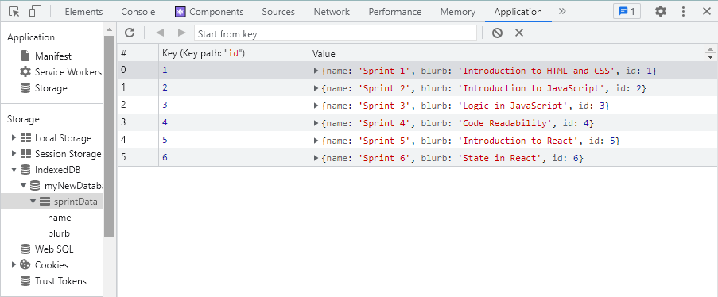

# `Introducing Data!`

## Setup

- Clone the repo onto your machine by opening the terminal at your workspace folder and typing `git clone` followed the 'SSH key'.
- Create a new branch with `git checkout -b YOUR_NAME`
- Open the repo with `code .`
- Open this readme file in VS Code and click `ctrl+shft+v`. This file will open in PREVIEW mode and will be a whole lot nicer to read...💥
- Enter the following commands in your terminal to get this app up and running...

  #### `npm install`
  #### `npm install react`
  #### `npm install sass`
  #### `npm start`

- Open [http://localhost:3000](http://localhost:3000) to view it in your browser. 🤙 <br> 

## Overview

This repo is designed to help you learn how to integrate a database into your react-app in 4 stages:
1. Hard-code your data
2. Make an array of objects that stores your data
3. Move your data into a seperate file and display it using the Array.map() method
4. Set up 'local storage' using Dexie.

Have a read of this article that answers the fundamental question: [What is data?](https://www.webopedia.com/definitions/data/)

In this exercise you are going to be building an app that displays a list of Sprints on the screen.

To start, begin by having a look through the repository and familiarising yourself with it's contents. <br>
You will see that we are using React to break our app into components. <br>
You will also see that we are using Sass to break our CSS into different files too.<br>
Doing this makes things clearer and helps us (and others) understand our codebase better.<br>

For now the only file we are going to be working in is 'DashBoard.jsx' - so open that up alongside this file in splitscreen.<br>

## Stage 1

Firstly I want to see a list of sprints that each have a 'name' and a 'blurb' like this:

- "Sprint 1" "Introduction to HTML and CSS"

- "Sprint 2" "Introduction to JavaScript"

- "Sprint 3" "Logic in JavaScript"
 
- "Sprint 4" "Code Readability"

- "Sprint 5" "Introduction to React"

- "Sprint 6" "State in React"

Each of these sprints should be wrapped in their own `<div></div>` tags, with the className 'sprint-box'. <br>

Check out those cool looking sprints! 
We now have some hard-coded information that our app users can read, lets start to structure that information like a 'dataset'...

## Stage 2

In this next stage we are going to shift our list of sprints into an array called sprintData that looks like this: <br>

```
const sprintData = [
  {
    name: "Sprint 1",
    blurb: "Introduction to HTML and CSS"
  },
  {
    name: "Sprint 2",
    blurb: "Introduction to JavaScript"
  },
  {
    You have to write the rest....
  }
 ]
```
This array will sit inside your 'DashBoard.jsx' file inside the above the return.<br>

Nice, you have just made a type of dataset known as 'Static Storage'.
To use this dataset you need to replace each hard-coded value with the equivalent value stored in sprintData. 
Accessing the data for the first sprint box will look like this:

```
<div className='sprint-box'>
  <h1>{sprintData[0].name}</h1>
  <p>{sprintData[0].blurb}</p>
</div>
```
Some key things to note here are:
- [Array indexing starts at 0](https://blog.kevinchisholm.com/javascript/javascript-array-length-always-one-higher/#:~:text=Arrays%20in%20JavaScript%20are%20zero,2%E2%80%9D%2C%20and%20so%20on.)
- [Objects are made up of 'key: value' pairs](https://www.freecodecamp.org/news/javascript-object-keys-tutorial-how-to-use-a-js-key-value-pair/)

So here we are telling React: 
- Look into the sprintData array
- Select the first object in the array
- Give me the value of whatever has the 'name' key and display it inside the `<h1></h1>` tags
- Give me the value of whatever has the 'blurb' key and display it inside the `<p></p>` tags

Once you have finished replacing all of your hard-coded information with the data from your sprintData array, you have successfully integrated a 'dataset' into your front-end. Congrats! 😊<br>

In the next stage we are going to spice things up a bit ... 🌶️

## Stage 3

In this stage we are going to do two things:
1. Seperate our data into a different file.
2. Remove our list of sprints and replace it with a function that uses the Array.map() method to map out a list of our sprints for us.

### Part 1

- Cut your `const sprintData = [...]` array out of the DashBoard.jsx file and paste it into a new file in the src folder called 'sprintData.js'.
- Add the term `export` before the `const` at the start of the file. This allows the data on this page to be imported into other files. Click [here](https://developer.mozilla.org/en-US/docs/web/javascript/reference/statements/export) to learn more about imports and exports.
- Import your data into DashBoard.jsx by adding the following command to the top of the file: `import {sprintData} from './sprintData'`

Your sprints should still load just the same as before, the only difference is that React is looking for your data in a seperate file. Have a look in the browser to see if everything is working...

### Part 2

This part is a little more complicated so you might want to refresh your memory on using the [Array.map() method](https://www.freecodecamp.org/news/javascript-map-how-to-use-the-js-map-function-array-method/) and remember to save your work!

- Delete the line that says `<DashBoard />` inside App.jsx and say goodbye to all of your hard work in the DashBoard.jsx file 😢
- Open up the DashBoardMapped.jsx file 
- Inbetween the fragment `<></>` tags add some curly braces: `{}`. This lets React know that it should read your code inside these braces as JavaScript.
- Inside the curly braces you are going to map over your sprintData array and return a sprint-box for each object in the array. Have a look at the first couple of pictures in [this example](https://linguinecode.com/post/how-to-use-map-react) to try and figure out how to do this. 
- This is hard, so I have provided a cheatsheet... Your code is going to look like this:

```
{sprintData.map(sprint => {
  return(
    <div className='sprint-box'>
      <h1>{sprint.name}</h1>
      <p>{sprint.blurb}</p>
    </div>
  )
})}
```

Basically what we are telling React here is:
- Look into the sprintData array
- 'Map over' that array and give each object the name 'sprint'
-  For each sprint go and return a chunk of code that contains the values assigned to the 'name' key and the 'blurb' key. This is just like what we did in Stage 2 but without the `[0]` array index position. Here we don't need to provide an index position because our Array.map() function is mapping out literally every object inside the array.

Have a look in the browser to see if everything is working... If it is, nice work! You have successfully imported some data into a React component and displayed that data using an array method that returns a JSX element! 🔥🔥🔥

## Stage 4

Get off your high horse, things are about to get a whole lot tougher 🤣

In this section we are going to install an external library called 'Dexie' that will allow us to store our data beyond the shores of our humble VS Code island...🏝️ With Dexie we will be able to store our data INSIDE the browser in what is known as 'Local Storage'.<br>

This may be a little confusing to get your head around but essentially 'localStorage' is a property that allows JavaScript sites and apps to save key-value pairs in a web browser with no expiration date. This means the data stored in the browser will 'persist' (hence the name of this course) even after the browser window is closed.<br>

A persistent database needs 4 key functions: *Create, Read, Update* and *Delete*. When it has these 4 functions, it is known as a CRUD database. Click [here](https://www.sumologic.com/glossary/crud/) to read more about CRUD databases.

You are now going to have a go at installing and setting up your first CRUD database using the Dexie library. The following steps are taken from [these docs](https://dexie.org/docs/Tutorial/React) so if you are feeling confident, try and complete this section based on the information provided there. Remember: when it comes to data, persistence is crucial! 

### *Create*

- Navigate to this repo in the terminal and install dexie with `npm install dexie` and `npm install dexie react-hooks`
- Create a file in your 'src' folder called 'db.js'
- Inside this file you will need to do 5 things: <br>
1. Import the Dexie library: `import Dexie from 'dexie'` <br>
2. Create a new Dexie database called 'myDatabase' and Export it: `export const db = new Dexie('myDatabase')`<br>
3. Create a new Dexie database store that outlines the structure of your data by giving it the key 'sprintData' with the value '++id, name, blurb':
```
db.version(1).stores({
sprintData: '++id, name, blurb',
})
```
4. We now want to add some data to the 'sprintData' store. To do this, Dexie requires us to perform a `transaction` function as follows. This code looks confusing, but it is basically just Dexie's way of saying "add a piece of data to my database store `db.sprintData` that can be read and written (`"rw"`) and has these key-value pairs":
```
db.transaction("rw", db.sprintData, () => {
  db.sprintData.add({
    name: "Sprint 1",
    blurb: "Introduction to HTML and CSS",
  })
```
5. The code above contains only one sprint, now you have to add the other sprints by repeating the function `db.sprintData.add({...)}` for each. Remember to close the whole db.transaction function with the correct brackets at the end.
<br><br>
Congratulations, you have now finished the *Create* part of your CRUD database! 🐐

### *Read* 

Now that you have created your data, it is time to read that data. 
- At the top of your DashBoardMapped.jsx file import your db.js file like you did with your sprintData.js file in Stage 3: `import {db} from "./db"`
- To '[query](https://www.hostinger.com/tutorials/what-is-a-query)' our data we are going to use a Dexie query method called 'useLiveQuery'
- At the top of your DashBoardMapped.jsx file import useLiveQuery: `import {useLiveQuery} from "dexie-react-hooks"`
- Create a constant called sprintData
- This constant is going to call upon the useLiveQuery method which will run an arrow function that will turn our sprintData into an array
- The code will look like this:
```
  const sprintData = useLiveQuery(
    () => db.sprintData.toArray()
  )
```

Now we need to change our `{sprintData.map(...)}` function to cater for Dexie. 
- First we need to make our function say "Have I received any sprintData from the query? If so, map over it". We do this by adding a `?` after `sprintData`
- Your code should now look like this: `{sprintData?.map(...)}`
- Secondly we need to provide a key for each of our sprints. This is because in React [each child in a list should have a unique 'key' property](https://reactjs.org/docs/lists-and-keys.html#keys).
- As Dexie gives each of our sprints a unique 'id' number, we can do this by adding `key={sprint.id}` inside the `<div>` tag at the start of our `sprint-box`.

If everything has gone to plan you should now have your sprintData being stored in Local Storage. To view this data, open up the Dev Tools in the browser and click on the 'Application' tab. Under where it says Storage you will see 'IndexedDB' and inside that you should be able to find your database and your sprintData. It should look something like this:



You have now successfully *Created* and *Read* data inside a persistent Local Storage database, nice! 🤯

If you want to keep learning, take a break then try to achieve some stretch goals...

## Stretch

1. *Update*
2. *Delete*